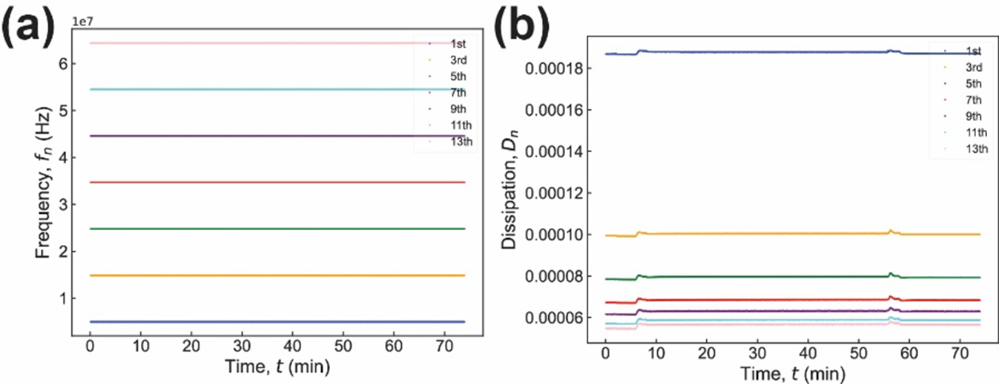
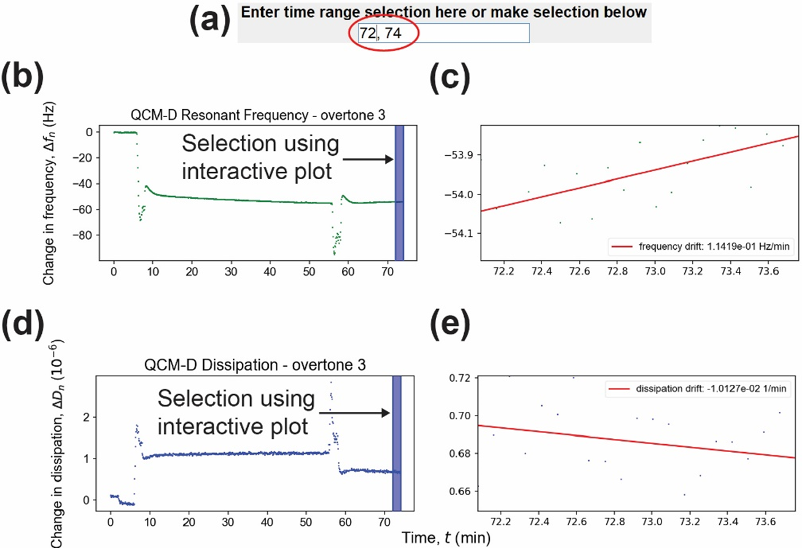

# Summary

Here, we present a Python-based software that allows for the rapid visualization, data mining, and basic model applications of quartz crystal microbalance with dissipation data. Our implementation begins with a Tkinter GUI to prompt the user for all required information, such as file name/location, selection of baseline time, and overtones for visualization (with customization capabilities). These inputs are then fed to a workflow that will use the baseline time to scrub and temporally shift data using the Pandas and NumPy libraries and carry out the plot options for visualization. The last stage consists of an interactive plot, that presents the data and allows the user to select ranges in MatPlotLib-generated panels, followed by application of data models, including Sauerbrey, thin films in liquid, among others, that are carried out with NumPy and SciPy. The implementation of this software allows for simple and expedited data visualization and analysis, in lieu of time consuming and labor-intensive spreadsheet analysis.

---

# Statement of need

QCM-D has gained popularity in many different scientific fields due to its experimental simplicity and versatility. QCM-D (or just QCM if not quantifying energy losses) can be combined with a variety of instruments for in situ complementary measurements, such as atomic force microscopy (AFM),[@Friedt:2003] microtribometry,[@Borovsky:2019] surface plasmon resonance (SPR),[@Bailey:2002] or electrochemistry,[@Levi:2016] among others. However, one drawback rests in that any QCM-D experiment, real-time monitoring of sensor surface-environment generates large volumes of data entries, and packages used to collect data do not typically possess straightforward data visualization, data mining capabilities, and basic model applications. Furthermore, programs associated with QCM-D data collection and analysis are often proprietary with limited access. There exists other open-source packages, such as RheoQCM[@Shull:2020] and pyQTM[@Johannsmann:2023], however, they focus on more complex data modeling rather than data mining. `pyQCM-BraTaDio` can serve as a complement to these two packages Here, we present an intuitive Python-based, open-source software that is QCM-D manufacturer agnostic of multi-harmonic collecting systems for (1) simple and fast data visualization and interaction, (2) data mining and reduction, , and (3) basic model applications. The supported models include (i) Sauerbrey, for rigid thin films, (ii) viscoelastic thin film in a Newtonian liquid, (iii) viscoelastic thin film in air,  and (iv) quartz crystal thickness determination. 

---

# Software interaction

The interaction with `pyQCM-BraTaDio` is via a GUI, which allows the user to utilize the software with minimal to no console interaction. It operates following the workflow shown in SI figure 2, The main window is organized into four main regions, shown in \autoref{fig:1}. These regions are (1) initialization conditions, (2) selection of frequencies and dissipation for data mining, visualization, and model application purposes, (3) interactive plots for data mining, and (4) selection of plotting options and models.

---

# Notable features of `pyQCM-BraTaDio`

### Expedited basic visualizations

As in any experimentally obtained data, visual inspection is crucial for an initial assessment of baseline stability, anomalies, such as presence of undesired air bubbles, leaks, signal loss, among others. Two basic visualization options are implemented in the `pyQCM-BraTaDio` tool: (i) a full data range visualization referred here as raw data, \autoref{fig:2}, and (ii) the experimental data, referred here as reference level adjusted data, \autoref{fig:3}. For these options, the user can select the overtone order(s) to visualize the frequency and dissipation in various plotting formats. \autoref{fig:2}(a) and (b) show the absolute frequency $f_{n}$ and dissipation $D_{n}$ as a function of time $t$ for $n = 1, 3, 5, 7, 9, 11$ and $13$ for a bovine serum albumin (BSA) solution absorbing to a gold substrate. The relevant experimental data can be visualized by selecting the ‘Plot shifted data’ option. For example, change in frequency as a function of time, ${\Delta}f_n$ vs time $t$, \autoref{fig:3}(a), change in normalized frequency as a function of time, ${\Delta}f_n/n$ vs time $t$, \autoref{fig:3}(b), change in dissipation ${\Delta}D_n$ vs time $t$, \autoref{fig:3}(c), combined change in frequency and change in dissipation as a function of time, ${\Delta}f_n$ and ${\Delta}D_n$ vs time $t$, \autoref{fig:3}(d), combined change in normalized frequency and change in dissipation as a function of time, ${\Delta}f_n/n$ and ${\Delta}D_n$ vs time t, \autoref{fig:3}(e), the temperature $T$ as a function of time, $T$ vs $t$, \autoref{fig:3}(f), which is critical to determine any temperature effects in collected data. Finally, change in dissipation as a function of change in frequency, ${\Delta}D_n$ vs ${\Delta}f_n$, \autoref{fig:3}(g), and change in dissipation as a function of change in normalized frequency, ${\Delta}D_n$ vs ${\Delta}f_n/n$, \autoref{fig:3}(h) to obtain qualitative insights of the adsorbed film rigidity. 

### Data mining via an interactive plot

To facilitate the procedure of data mining, that is, selection of frequency and dissipation ranges for time ranges of interest, it is possible to interact with the data via an interactive plot, \autoref{fig:4}. `pyQCM-BraTaDio` will compute the average and standard deviation of the data points contained within the selected range for each overtone selected and display the selection with a linear fit, every time a selection is made. Through the use of user dictated range identifiers, multiple selections can be made without overwriting data. Overwriting only occurs when further selections are made without updating the range identifier *ex ante*.

### Applications of models
Matching QCM-D experimental data to models that provide physical interpretation is key for the quantitative characterization of liquids interacting with the quartz crystal surfaces or nanofilms. With `pyQCM-BraTaDio`, it is possible to apply models of steady state (in equilibrium) thin films using one of the following models: (i) the Sauerbrey equation for very thin films,[@Sauerbrey:1959] (ii) shear-dependent compliance of a thin viscoelastic film in a Newtonian liquid,[@Du:2004] and (iii) determination of the quartz crystal thickness.[@Reviakinea:2004] These models are described in the SI, accompanied with experimental examples. 

---

# Conclusions

pyQCM-BraTaDio is a Python software implemented ad hoc to expedite the process of data mining and analysis of QCM-D experimental data. Beginning  with a Tkinter GUI for metadata collection, the inputs and data are fed to several routines to mine and reference level adjust data with the Pandas and NumPy libraries. The user is able to interact with QCM-D data in a novel way via a MatPlotLib interactive plot widget towards the end of the workflow. This interaction offers the user to apply several models such as Sauerbrey, thin film in liquid, thin film in air, and crystal thickness. This tool is key for efficient data analysis in preference over laborious spreadsheet evaluation.

---

# Acknowledgements

R.C.A.E. acknowledges funding from the NSF-CREST: Center for Cellular and Biomolecular Machines through the support of the National Science Foundation (NSF) Grant No. NSF-HRD-1547848. R.C.A.E. and B.P. acknowledge funding from the CAREER grant NSF CMMI Grant No. #2239665 awarded to R.C.A.E. 

---

# Supporting information
The authors have compiled additional supporting information in a separate document containing more details on the software’s execution, as well as demonstrating the efficacy of the software across multiple QCM-D devices.

# References